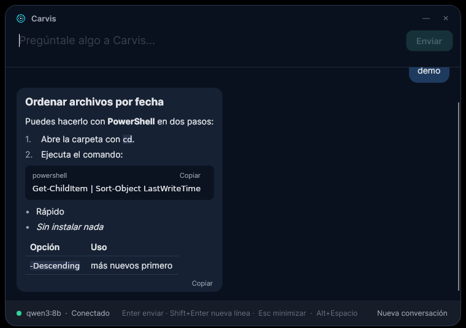

# Carvis

Asistente de IA local para Windows, estilo Jarvis. Se abre con **Alt+Espacio** y responde en streaming usando un modelo que corre en tu propio PC con [Ollama](https://ollama.com). Sin APIs de pago y sin enviar nada a Internet.



## Requisitos

- Windows 10/11
- [.NET 8 SDK](https://dotnet.microsoft.com/download/dotnet/8.0)
- [Ollama](https://ollama.com/download) instalado y en marcha
- Los modelos descargados:

```powershell
ollama pull qwen3:8b
ollama pull nomic-embed-text   # se usará en la fase 2 (indexado de documentos)
```

## Arrancar

```powershell
git clone https://github.com/carvima07eng-dot/Carvis.git
cd Carvis
dotnet run --project src/Carvis.App
```

O desde la carpeta de la app:

```powershell
cd src/Carvis.App
dotnet run
```

Al arrancar aparece la ventana, con su botón en la barra de tareas y un icono en la bandeja del sistema (en Windows 11 puede estar dentro de la flecha **^**; arrástralo a la barra para tenerlo siempre a mano). Solo hay una instancia: si vuelves a ejecutar Carvis, se muestra la que ya está abierta.

| Acción | Cómo |
|---|---|
| Mostrar / traer al frente | **Alt+Espacio**, el botón de la barra de tareas o el icono de la bandeja |
| Enviar mensaje | **Enter** |
| Nueva línea | **Shift+Enter** |
| Recuperar el último mensaje | **↑** con la caja vacía |
| Detener la respuesta | Botón **Detener** |
| Minimizar | **Esc**, **Alt+Espacio** o el botón **—** |
| Ocultar en la bandeja | Botón **✕** |
| Mover la ventana | Arrastra la barra superior |
| Copiar una respuesta o un bloque de código | Botón **Copiar** |
| Empezar de cero | **Nueva conversación** |
| Arrancar con Windows | Icono de la bandeja → **Iniciar con Windows** |
| Salir | Icono de la bandeja → **Salir** |

Las respuestas se muestran con formato (negritas, listas, tablas, bloques de código). Al arrancar Carvis carga el modelo en memoria para que la primera respuesta no tarde, y lo mantiene cargado 30 minutos.

Si Ollama no está abierto o falta el modelo, Carvis lo indica en la propia ventana con el comando para solucionarlo y un botón **Reintentar**.

## Configuración

`src/Carvis.App/appsettings.json` (se copia junto al ejecutable):

```json
{
  "Ollama": {
    "BaseUrl": "http://localhost:11434",
    "ChatModel": "qwen3:8b",
    "EmbeddingModel": "nomic-embed-text",
    "EnableThinking": false,
    "KeepAlive": "30m",
    "RequestTimeoutSeconds": 300
  },
  "Hotkey": { "ToggleWindow": "Alt+Space" },
  "Assistant": {
    "SystemPrompt": "Eres Carvis, ...",
    "MaxHistoryMessages": 40
  },
  "Window": { "StartHidden": false, "HideOnFocusLost": false }
}
```

- `Hotkey.ToggleWindow`: modificadores `Ctrl`, `Alt`, `Shift`, `Win` + una tecla (`Space`, `J`, `F1`...). Ejemplo: `"Ctrl+Shift+J"`.
- `EnableThinking`: deja que qwen3 "piense" antes de responder (más lento; el razonamiento no se muestra).
- `KeepAlive`: cuánto tiempo mantiene Ollama el modelo en la GPU tras la última pregunta (`"-1"` = siempre).
- `StartHidden`: arranca solo en la bandeja.
- `HideOnFocusLost`: modo Spotlight. Con `true` la ventana va siempre encima y se oculta al hacer clic fuera; con `false` (por defecto) se comporta como una app normal.

Si Alt+Espacio no hace nada, puede que otro programa lo esté usando (por ejemplo PowerToys Run). Cambia `Hotkey.ToggleWindow` a otro atajo, como `"Ctrl+Shift+Space"`.

## Tests

```powershell
dotnet test
```

## Estructura

```
src/Carvis.App     UI con Avalonia (MVVM con CommunityToolkit.Mvvm), bandeja, atajo global (SharpHook)
src/Carvis.Core    Servicios sin UI: chat, cliente de Ollama, configuración y contratos de las próximas fases
tests/Carvis.Tests Tests xUnit del Core
```

Piezas principales del Core:

- `IChatService` / `ChatService`: conversación con historial, streaming y filtrado de bloques `<think>`.
- `IChatModelClient` / `OllamaChatModelClient`: llamada al modelo con OllamaSharp.
- `IOllamaHealthCheck`: comprueba que Ollama responde y que el modelo está descargado.
- `IChatContextProvider`: punto de entrada para añadir contexto a cada pregunta (lo usará el RAG).

## Hoja de ruta

- [x] **Fase 1**: ventana flotante, chat en streaming con historial, comprobación de Ollama, bandeja, configuración y tests.
- [ ] **Fase 2**: indexar carpetas (PDF con PdfPig, DOCX con OpenXML, txt/md), trocear, embeddings con `nomic-embed-text`, guardar en SQLite + sqlite-vec y responder con RAG citando archivos. Contratos en `Carvis.Core/Indexing`.
- [ ] **Fase 3**: acciones con tool calling (abrir programas, mover/renombrar archivos, ejecutar scripts) siempre con confirmación en la UI. Contratos en `Carvis.Core/Tools`.
- [ ] **Fase 4**: voz con Whisper.net (entrada), Piper (salida) y palabra de activación "Carvis". Contratos en `Carvis.Core/Voice`.
- [ ] **Fase 5**: captura de pantalla con atajo y análisis con `qwen2.5vl`. Contratos en `Carvis.Core/Vision`.
