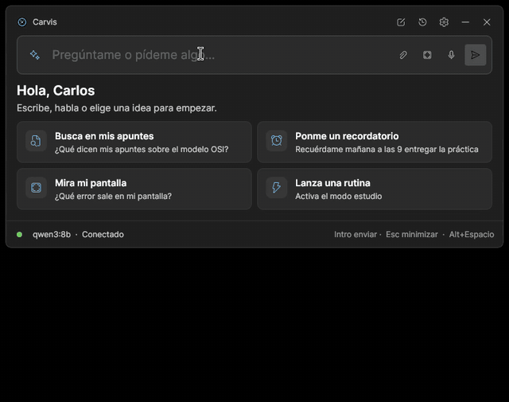

# Carvis

[](https://github.com/carvima07eng-dot/Carvis/actions/workflows/ci.yml)
[](https://github.com/carvima07eng-dot/Carvis/releases/latest)
[](LICENSE)


Carvis es un asistente de IA para Windows que funciona **entero en tu PC**. Se abre con **Alt+Espacio**, contesta con un modelo local de [Ollama](https://ollama.com) y puede hacer cosas por ti, siempre preguntándote antes de cambiar nada. No usa APIs de pago y tus datos no salen del equipo.




## Qué hace

- **Habla contigo** con respuestas en streaming, formato y código. Guarda el historial cifrado y puedes usarlo con la voz (Whisper y Piper, también en local).
- **Busca en tus apuntes**: lee tus PDF, Word, Excel y PowerPoint y te contesta diciendo de qué archivo y de qué página sale cada cosa.
- **Te organiza el día** con recordatorios, temporizadores y rutinas ("modo estudio" = abrir VS Code, la carpeta de apuntes y bajar el volumen).
- **Mira tu pantalla**: captura una zona y pregúntale qué error sale, o copia su texto con OCR. Además maneja archivos, programas, ventanas, volumen y música, y casi todo se puede deshacer.

## Requisitos

- Windows 10 u 11 de 64 bits. En Windows 11 se usa el fondo Mica.
- Gráfica NVIDIA con 8 GB de VRAM o más (recomendado 12 GB). Sin gráfica funciona, pero mucho más lento.
- Unos 7 GB de disco para los modelos. La voz ocupa 0,5–2 GB más y la visión, 6 GB más.

## Instalar

1. Instala [Ollama](https://ollama.com/download). El asistente de Carvis también puede instalarlo por ti con winget.
2. Descarga `CarvisApp-win-Setup.exe` de la [última versión](https://github.com/carvima07eng-dot/Carvis/releases/latest) y ábrelo. No pide permisos de administrador.
3. Sigue el asistente de primer arranque: comprueba Ollama, descarga los modelos, te pregunta qué carpetas leer y prueba el atajo.

> El instalador aún no está firmado. Si Windows SmartScreen avisa, pulsa «Más información» → «Ejecutar de todas formas».

Todo lo demás (atajos, comandos como `/liberar`, voz, capturas, ajustes y privacidad) está en el **[manual de usuario](docs/MANUAL.md)**. Si algo no va, mira [solución de problemas](docs/TROUBLESHOOTING.md).

## Seguridad y privacidad

- Lo que cambia algo se confirma. Borrar, apagar y ejecutar scripts preguntan siempre.
- El texto que viene de webs o documentos se marca como **origen externo** y nunca puede dar órdenes.
- Las funciones menos maduras (PowerShell, servidores MCP, complementos, escucha continua) están en **Ajustes → Experimental** y vienen apagadas.

Los detalles están en [SECURITY.md](SECURITY.md).

## Desarrollo

Necesitas el [SDK de .NET 8](https://dotnet.microsoft.com/download/dotnet/8.0).

```powershell
git clone https://github.com/carvima07eng-dot/Carvis.git
cd Carvis
dotnet run --project src/Carvis.App
dotnet test
```

- [CONTRIBUTING.md](CONTRIBUTING.md): cómo proponer cambios, estilo y sistema de diseño.
- [docs/ARCHITECTURE.md](docs/ARCHITECTURE.md): cómo está hecho y cómo añadir una herramienta.
- [docs/PERFORMANCE.md](docs/PERFORMANCE.md): métricas, uso de la gráfica y modelo multimodal.
- Evaluación con el modelo real (80 frases, informe por categoría): `dotnet run --project tests/Carvis.Evals -- --report informe.md`
- [CHANGELOG.md](CHANGELOG.md) · [THIRD-PARTY-NOTICES.md](THIRD-PARTY-NOTICES.md)

## Licencia

[MIT](LICENSE) © 2026 Carlos Vidal Marín. Las licencias de las bibliotecas, los modelos y las voces están en [THIRD-PARTY-NOTICES.md](THIRD-PARTY-NOTICES.md). Ojo: algunas voces de Piper solo permiten uso no comercial.
